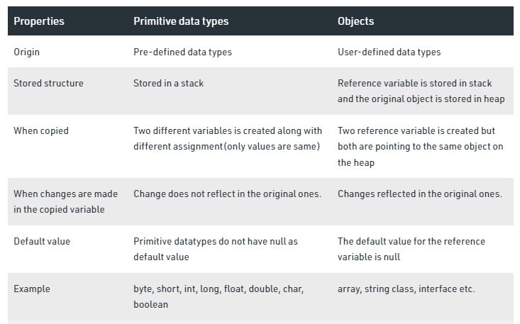

# Read: 03 - Maps, primitives, File I/O
## java primitives vs objects
Java has a two-fold type system consisting of primitives such as int, boolean and reference types such as Integer, Boolean. Every primitive type corresponds to a reference type.

* Primitive Data Type: In Java, the primitive data types are the predefined data types of Java. They specify the size and type of any standard values. Java has 8 primitive data types namely byte, short, int, long, float, double, char and boolean. When a primitive data type is stored, it is the stack that the values will be assigned. When a variable is copied then another copy of the variable is created and changes made to the copied variable will not reflect changes in the original variable. Here is a Java program to demonstrate all the primitive data types in Java.

* Object Data Type: These are also referred to as Non-primitive or Reference Data Type. They are so-called because they refer to any particular objects. Unlike the primitive data types, the non-primitive ones are created by the users in Java. Examples include arrays, strings, classes, interfaces etc. When the reference variables will be stored, the variable will be stored in the stack and the original object will be stored in the heap. In Object data type although two copies will be created they both will point to the same variable in the heap, hence changes made to any variable will reflect the change in both the variables. Here is a Java program to demonstrate arrays(an object data type) in Java.
 

## Exception
is an event, which occurs during the execution of a program, that disrupts the normal flow of the program's instructions.